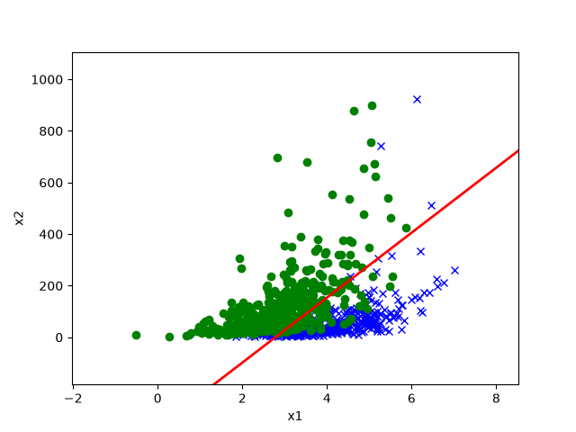
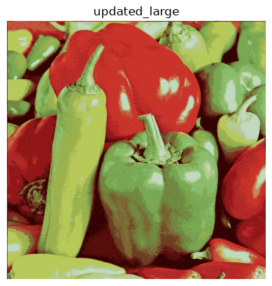
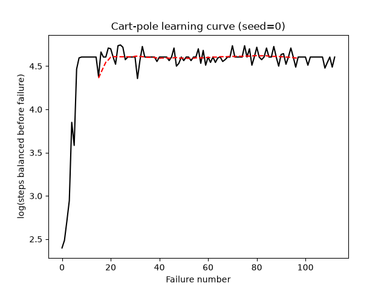
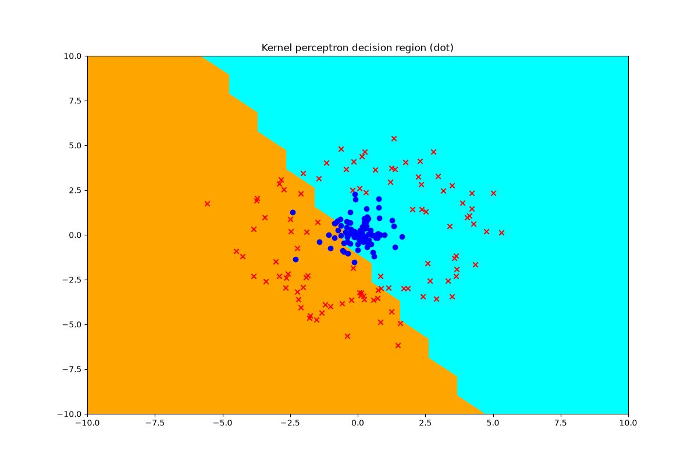
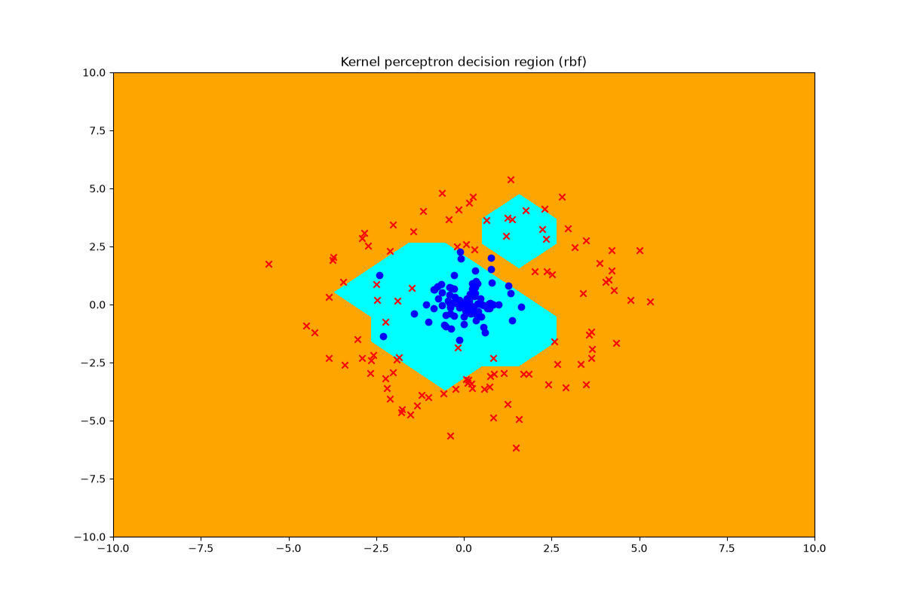
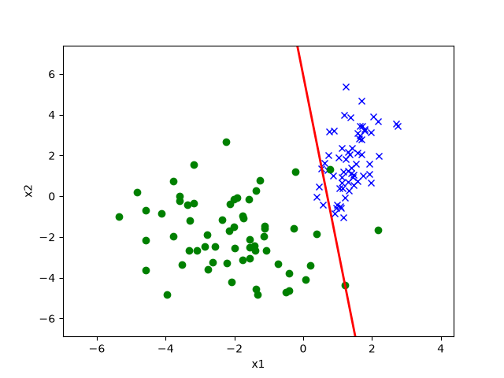

# CS229 Machine Learning — Problem-Set Coding Solutions

> Vectorised NumPy implementations of the coding portions of the **Stanford
> CS229 — Machine Learning** problem sets — an independent, from-skeleton
> implementation, part of a [csdiy.wiki](https://csdiy.wiki/) full-catalog build.


## Overview

CS229 (Andrew Ng; this build follows the widely-mirrored 2018 autumn offering)
is Stanford's graduate machine-learning course. Its four problem sets ship
NumPy starter skeletons with real datasets and mark the coding tasks with
`*** START CODE HERE ***`. This repo implements **every coding problem** across
PS1–PS4 from scratch in clean, vectorised NumPy — supervised learning and GLMs,
generative and kernel methods, unsupervised learning, and reinforcement
learning — and reports the **measured** result of actually running each one.

## Results (measured on CPU, `OMP_NUM_THREADS=3`, NumPy 2.4)

| Problem set | Assignment | What it does | Result (measured) |
|---|---|---|---|
| PS1 | 1b Logistic regression (Newton) | binary classification | val acc **0.90** (ds1), **0.91** (ds2) |
| PS1 | 1e GDA | generative classifier | val acc **0.83** (ds1), **0.91** (ds2) |
| PS1 | 2 Positive-only labels | α-correction | test acc vs true label: naive **0.50** → corrected **0.95** (oracle 0.98) |
| PS1 | 3d Poisson regression (GLM) | count regression | val corr(true, pred) **1.00** |
| PS1 | 5b/5c Locally weighted regression | non-parametric fit + τ sweep | best τ = **0.05**, val MSE **0.0124**, test MSE **0.0170** |
| PS2 | 5 Kernel perceptron | linear vs RBF kernel | test acc: dot **0.525** vs RBF **0.920** |
| PS2 | 6 Naive Bayes spam | multinomial NB + Laplace | test acc **0.9785**; top words: `claim, won, prize, tone, urgent!` |
| PS2 | 6 SVM spam (RBF, Pegasos) | radius tuning | best radius **0.1**, test acc **0.9695** |
| PS3 | 4 EM for GMM | unsup. + semi-sup. | unsup. ~**117** iters (LL ≈ −1835); semi-sup. ~**19** iters |
| PS3 | 5 k-means image compression | colour quantization | 16 colours → **4 bits/px**, **6× compression** |
| PS4 | 4 ICA | blind source separation | 5 mixed → 5 separated `.wav`; unmixing `W` recovered |
| PS4 | 6 Cart-pole control | model-based RL + value iteration | balance time **11 → ~100 steps**, converged after **113** failures |

### A few figures (full set in [`results/figures/`](results/figures))

| GDA decision boundary (PS1) | k-means 6× compression (PS3) | Cart-pole learning curve (PS4) |
|---|---|---|
|  |  |  |

| Kernel perceptron — dot (fails) | Kernel perceptron — RBF (separates) | Positive-only: naive vs α-corrected |
|---|---|---|
|  |  |  |

## Implemented assignments

- [x] **PS1 1b** — Logistic regression via Newton's method
- [x] **PS1 1e** — Gaussian Discriminant Analysis
- [x] **PS1 2** — Logistic regression with incomplete, positive-only labels (+ α correction)
- [x] **PS1 3d** — Poisson regression (GLM, gradient ascent)
- [x] **PS1 5b/5c** — Locally weighted linear regression + bandwidth tuning
- [x] **PS2 5** — Kernelized perceptron (dot & RBF kernels)
- [x] **PS2 6** — SMS spam classification: multinomial Naive Bayes + RBF-kernel SVM
- [x] **PS3 4** — EM for a Gaussian Mixture Model (unsupervised & semi-supervised)
- [x] **PS3 5** — k-means colour compression
- [x] **PS4 4** — Independent Component Analysis (blind source separation)
- [x] **PS4 6** — Cart-pole balancing with model-based RL / value iteration

## Project structure

```
cs229-machine-learning/
├── data/            # real CS229 datasets, split per problem set (ps1..ps4)
├── ps1/src/         # regression & GLMs (util, linear_model, p01..p05, run.py)
├── ps2/src/         # perceptron, Naive Bayes, SVM
├── ps3/src/         # EM/GMM, k-means
├── ps4/src/         # ICA, cart-pole RL (+ course-provided env.py physics)
├── notes/           # derivations tying the math to the code
├── results/         # run logs + curated figures/
├── requirements.txt
└── LICENSE
```

## How to run

```bash
# Python 3.11. Use the shared csdiy env or a fresh venv:
python -m pip install -r requirements.txt

# Each problem set has a self-contained driver; run from its src/ directory.
cd ps1/src && python run.py      # all PS1 problems (or: python run.py 1)
cd ../../ps2/src && python run.py
cd ../../ps3/src && python run.py
cd ../../ps4/src && python run.py
```

Each driver writes predictions and figures to its local `output/` directory and
prints the measured metrics. On this machine every problem set runs on CPU in
under a couple of minutes (the kernel perceptron and cart-pole loop are the
slowest).

## Verification

Every number in the results table was produced by actually running the code on
this machine; the captured stdout for each problem set is in
[`results/`](results) (`ps1_run.log` … `ps4_run.log`) and the figures in
[`results/figures/`](results/figures). Highlights:

- **PS1** `p02` prints `α ≈ 0.17` and recovers test accuracy 0.50 → 0.95 with the
  correction; `p03d` reaches correlation 1.00 between predicted and true counts.
- **PS2** `p06` reports Naive Bayes test accuracy **0.9785** and the SVM radius
  sweep (`0.01→0.92, 0.1→0.95, 1→0.93, 10→0.88` on validation) selecting 0.1.
- **PS3** `p04` logs the monotonically-increasing log-likelihood and the
  iteration counts (unsupervised ~117 vs semi-supervised ~19); `p05` logs the
  decreasing distortion and the 6× compression ratio.
- **PS4** `p06` logs steps-to-failure climbing from 11 to ~100 and converging
  after 113 failures — the learning curve figure shows the plateau clearly.

## Tech stack

Python 3.11, NumPy (all models), Matplotlib (figures), SciPy (ICA `.wav` I/O and
the cart-pole learning-curve smoothing). No deep-learning frameworks — every
algorithm is implemented directly.

## Key ideas / what I learned

- Second-order optimisation (Newton's method) vs first-order gradient ascent,
  and when each is the natural fit (logistic regression vs the Poisson GLM).
- Generative (GDA) vs discriminative (logistic) modelling of the same boundary,
  and how the shared-covariance assumption shows up in the data.
- The kernel trick made concrete: the same perceptron goes from unable to
  separate the data (dot kernel) to 92% accuracy (RBF kernel).
- EM as coordinate ascent on a log-likelihood, and how a little supervision
  removes the label-permutation symmetry and accelerates convergence.
- Model-based RL: estimating an MDP from experience and solving it with value
  iteration to actually balance a pole.

## Credits & license

Based on the problem sets of **CS229: Machine Learning** by Andrew Ng and the
CS229 teaching staff (Stanford University). This repository is an independent
educational reimplementation; all course materials, problem statements, and
datasets belong to their original authors. The cart-pole physics simulator
(`ps4/src/env.py`) is course-provided infrastructure, used unmodified and
credited in-file. Original code in this repo is released under the
[MIT License](LICENSE).
